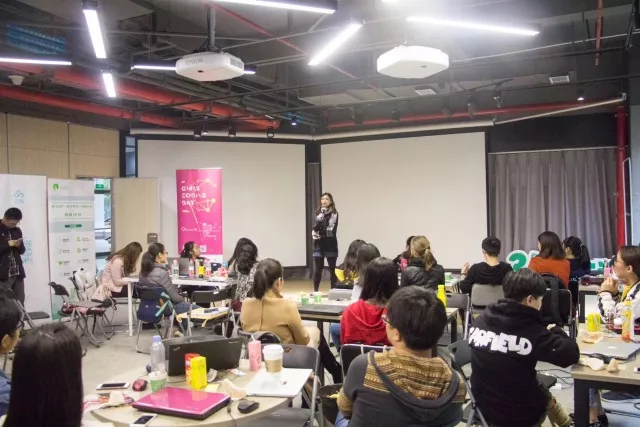
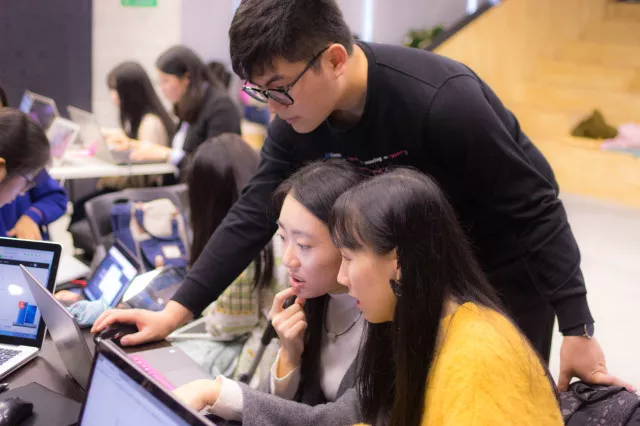
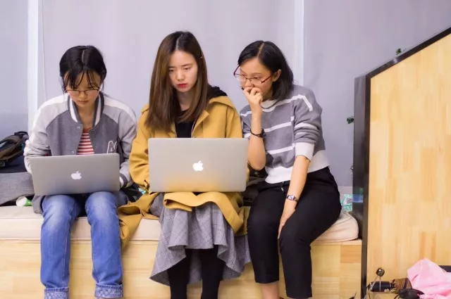
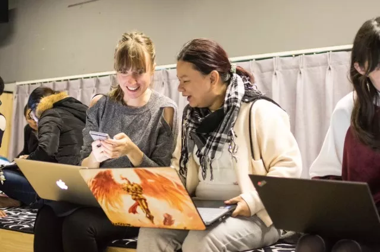
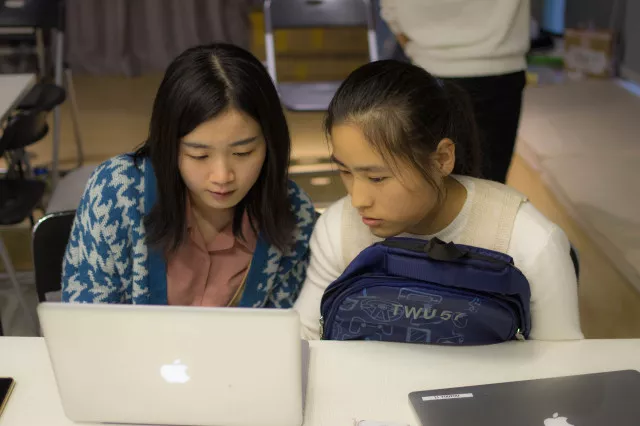
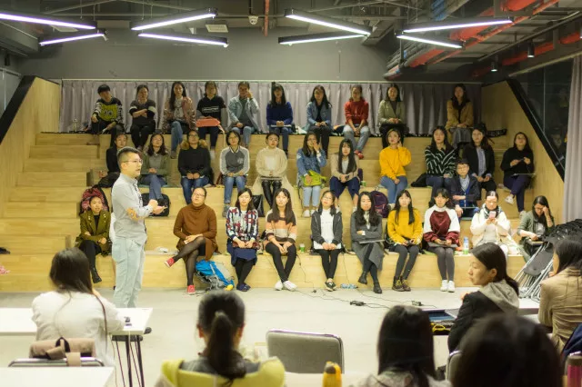

**文: 苏倩文**  
**图: Coding Girls Club笛**  

> 哇！好有趣的一群灵魂！
>         --- 这是来自2017成都站的小姐姐的感想

_2017.10.29_
最早知道Girls Coding Day这个活动是远在上海的小伙伴特意推给我的，叫我一定一定一定要参加！果然，现在距离活动完满结束已经过去好几天了，我仍旧处在一种特别兴奋的状态里。  

感觉自己特别特别幸运，认识了一群有趣的充满向上心，一群自我驱动力超强的小伙伴，打开了一扇新世界的大门。  

#### 一群有趣的灵魂
来参加活动的小姐姐们，有为了更了解程序员男朋友而来的，有学习编程为了回公司更理直气壮地跟程序员小哥哥互怼来的，有宣传动物保护的，有想为自己个人项目做网页的，有安利自己爱好的小姐姐，同一个组别内因为同一款游戏而相爱相杀的小姐姐，还有高二的小姐姐、外籍小姐姐。  
大家来到这里，互相学习互相交流，据说武汉站还有一个53岁的阿姨来参加，全程我都惊讶得张着嘴：哇！好有趣的一群灵魂！  

#### 终身学习
就跟转行小高手小姐姐说的一样，程序员是一个不断自我学习、自我更新迭代的群体，身处的环境氛围简直太重要了。教练们有各种各样解决问题的办法和思路，这都来源于他们丰富的学习和经验积累。  

某天，我问了一个问题，感觉小哥哥们都自带高冷属性呢，难道真的是传说中的007工作制？小哥哥说，或许在忙，不一定在工作，程序员们平时也都抽出很多业余时间用在学习上，只是没看到提问而已，看到了都会热情解答的。恍然大悟。  

#### 入门
真正的学习时间其实只有短短几天的业余时间，我们分好小组，确定好教练之后，就各自开始了学习的旅途。最近学到一个新词汇，联机学习。交流、互助、协作、请教、思想碰撞……一个人的学习、思考能力都及其有限，整天盘旋在自己的能力范围，很快就会遇到瓶颈。  

网络上的一个搜索、小伙伴们一个思想的火花、教练的一个引导，可能会让你少走很多弯路，少钻很多牛角尖，让你进步飞快。  

在小组里，每天晚上会有问题交流，我们的教练都会把握学习进度、解答我们的疑惑，我们简直就是，神力加持，进步神速！在此特意感谢自己的教练一兮老师——虽然你表面上比较冷酷，实际上却是暗中观察、授人以渔，充分给予我们信任，让我们自主思考过后，再指点解决的方法，也让我们在以后能走得更远。  

#### 发现
在整个学习中，更是发现了自己很多的不足之处。尤其这个学习方法的问题，最早的时候我们都觉得学什么东西必须全部学会了，做出来的东西才完美，才经得起考验，但是这显然已经不适合现在这个社会了。  

快节奏下，我们更多需要的是快速检验价值，快速做出最小交付，无惧试错，交付给市场，再根据回馈来迅速迭代，这才有生命力啊，不断迭代的能力才是最持久的竞争力啊。  

#### 成果
学习也是这样，短期内学习一个东西，你说我们是能够精通它吗？显然不能，我们其实是想通过学习，去尽可能地了解它，让它在自己的生活中起作用啊。什么叫学会？这个定义太困难了。把所有理论背下来，比起带着问题学习、寻求解决思路，然后做出自己想要的结果，哪一个更有价值？  

比如这次的Girls Coding Day活动，旨在让曾经认为自己离编程特别遥远的零基础小姐姐们在10个小时以内，搭建出自己的网页并部署在Git page上。  

小姐姐们也不负众望，最后展示环节中呈现出来的作品，大家都赞叹不已，短短几天之内，掌握了html、css的基本用法，还学会了利用bootstrap模板搭建网页，做出来的东西是自己以前从来没有想象过的！包括我自己，在整个过程中，满满的都是惊喜和成就感！  

#### 收获
这次的活动结束了，留给我的不仅仅像我当初来的目的那样，来学技术，学到的更多是一种学习精神，更多元地看待自己和周遭的方式。  

像证书上写的一样，愿我们都能由此出发，带着自信，激发自己的灵感和潜能，在不设限的人生中探索更多的可能性。  

#### 疯狂打call
讲真，大家都在焦虑，在时代背景下，仅凭个人努力，已经远远不够了。  

如果遇到了一个好的平台，真的不应该辜负它。主办方Girls Coding Club作为一个公益组织，我们的教练、志愿者在忙碌的工作生活中，抽出时间精力，默默地服务着，用心的程度，细节之处全是感动。所以最后，来打一波call！  

小班辅导、网红加持、水果饮料辣条，众多有趣的小姐姐小哥哥等你撩！关键还免费！  

## 对编程感兴趣的你，真的不来吗？  

