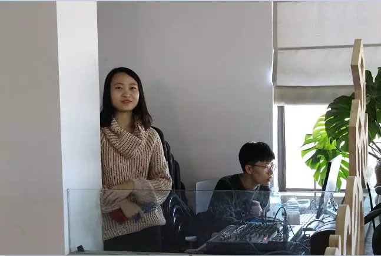

爆竹一声春梦晓  
大家好，今天是 2018 年 2 月 26 日，农历正月十一  
不管是去上班的还是去上学的小伙伴们应该都已经在路上了吧  
新年新气象，放不了爆竹，却可以放飞新希望  
而对于 Goding Girls Club 而言，新的一年也即将拉开序幕  
在这里，向各位支持我们、关心我们的朋友们、以及各位一起成长的小伙伴们拜个晚年，祝大家新年快乐！  

  

2017 年，Girls Coding Day 经历 7 个城市，最后在北京画上的圆满的句号  

> 愿你由此出发，带着自信，把编程当做一趟激发灵感和潜能的愉快旅程，愿你在不设上限的人生中探索更多的可能性。

我们的故事是在北京的 11 月一个明媚的早上开始的；天还没亮，志愿者们就已经来到活动场地开始准备，教练和学员们也都早早来到了现场  

  

虽然是第一次见面，但教练和学员们早在一周前就已经分好了组并且开始了初步的学习，已经在线上熟悉过一周的教练和学员们很快进入了状态  

  

打破了大家程序员中男性居多的印象，许多美丽的程序媛小姐姐来到了现场，悄悄告诉你们，这次活动女教练占了一半噢  

   

认真学习的小姐姐~  
你认真的样子最好看  

  

"教练，这里可以再讲一遍吗?"  

  

"哇！这真的是我做出来的吗？！”  

  

学霸的笔记！赶紧拍下来  

  

妄……妄图以噘嘴的方式教会学员？  

这个教练小哥哥实在是太可爱了  

  

活动的采访！大家看起来都很开心  

  

一天的活动结束，大家开始展示自己的作品  

   

嗯，作总结你是人群中最闪亮的星  

   

哎呀！偷拍leader被发现了！报名人数这么多，还有好多没能参加活动的小伙伴呢！你怎么还笑得这么淡定？！  

   

原来为了不让大家失望，在一周后的 12 月初我们又举办了一场  
 
  

你们在讨论什么？  

  

你……你们又在笑什么？能不能让我也听听嘛！  

  

大家都在热火朝天地学习，而我们可爱的志愿者小姐姐也正在勤奋地工作~  

  

这个姿势真的很专业了，快让大家看一看你拍到了些什么  

  

从志愿者的相机里找到了各种各样的照片吧~  
如果在这里发现了被记录下精彩一瞬的自己，记得给我们的志愿者点个赞噢！  

  

  

  

  

  

  

如果你一定要问为什么第一张大合照光线那么奇怪的话……我只能告诉你，第一场活动我们太热情把活动场地的电闸玩脱了  

北京场一共两场活动都完满地结束了，17 年的帷幕也落下了，但是这只是一个开始，我们的故事远没有结束，2018 年，我们将做得更好………  

