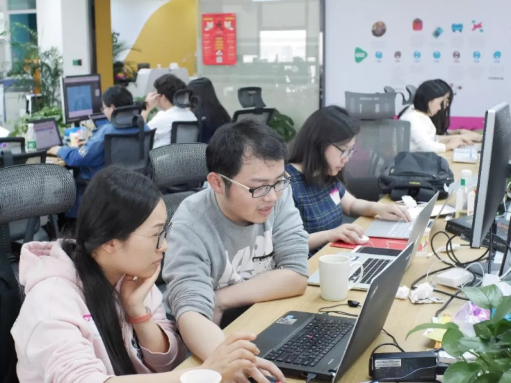

**文:** **刘司琪**  
**图:** **Coding Girls Club**

_菌菌有话说：_

> Girls Coding Day这个活动从去年夏天到现在，在很多个城市成功的举办过很多场活动，得到过很多人的支持，也收到过很多学员温暖真切的回馈。很多学员和我们沟通过，这个活动给了她们走进编程世界的勇气和信心；也有已经当了妈妈的学员和我们分享过，这个活动给了她的生活添加了很多乐趣，以及带来了新的希望。其实作为组织者，一路走来，我们的感触并不比学员少。  

今天给大家分享一篇来自今年Girls  Coding Day武汉场负责人，人美心善的程序媛——刘司琪小姐姐在活动结束后写的一篇感想~  
或许看完以后大家能发现，其实我们在坚持的，不只是举办这个活动本身，还有超过这个活动之外的，很多很多东西。  

  

2018年3月31日，武汉的第二期Girls Coding Day，也是我作为武汉GCD负责人组织的第一场活动。  

  
（3月31号武汉场活动现场）

去年的活动我还是个小教练，那时，我刚参加工作一年，而在那的一年前，我从未想过我会做这些跟科技与女性有关的事情。  

大概是自己极少面对性别歧视有关的事情吧，或者身边有些事情，但那些属于大众默认的事情让自己也习以为常了，虽然在网上，这些事情层出不穷。  

直到参加工作之后，有些想法发生了变化。ThoughtWorks，作为一个最佳女性雇主的科技公司，一直都在宣传着招聘性别比例1：1，对女性的各种优待，需要说的是，当年招聘那会儿也是被这个吸引，在众多HR问你什么时候结婚，男朋友在哪里工作的时候，TW的HR问我的是如何看待女性程序员。我认同如此对女性的尊重，但我依然坚定着无标签论者，不喜欢将女性这个词放大化，仿佛一直在提醒着大家，女性就是弱势群体，这也是带着标签的歧视。现在想想，当时也是害怕被贴上女性的标签吧，宁愿不去看它，仿佛一直逃避着这件事情就不会存在。然而渐渐地明白问题不会因为视而不见而消失，只有人去不断的提出它，不断地提示着所有人，问题在那呢，才有可能发生改变，才有希望被解决，才不会因为所有人的漠视而让问题以大家以为这才是理所应当而消失，比如当年面试的时候，我只会和身边的女生讨论着告诉面试官我们几年之内不会结婚而提高面试通过的几率。而这些想法的改变的最初，是因为在TW新人培训中，和一个美国男生的讨论。  

  
（3月31号武汉场活动现场）

之后，便是一年后参加了武汉的第一期也是全国的第一场Girls Coding Day，一个通过一天的时间，一群程序员教一群零技术基础的女性体验编程的活动，那场活动，来了各个年龄层各个专业的小姐姐，开始只是教他们写代码，到后来的闲聊中，感觉很多的女孩子因为各种标签而自我怀疑和否定，“我是女孩子，我是文科生，我数学不好，我行么？”  

活动的最后，每个学员都会在台上展示自己的作品，一个简单的静态页面。而我那时才发现，这个活动的意义不在于一天能真的学到些什么，能有一个机会尝试完全没接触过的东西，而这个东西，在人们的观念中又常常与女性这个词是对立的，这种自我的一个突破，能够告诉自己不要被任何标签束缚住，相信自己可以有无数的选择，去尝试自己想做的事情，才是这个活动想告诉每个学员的呀。  

我想做一个能提出问题的人，Girls Coding Day就成了一个小小的契机。想都没想的当晚直接给活动发起人文洋发了消息，明示暗示我想加入组织，文洋大概也是没想到能来一个免费有理想的劳动力，直接答应了，哈哈。  

关于文洋，我也想聊聊，这位Girls Coding Day的发起人，曾经将国外的Rails Girls引进中国，在各城市办了18场的免费workshop，现在又发起了Coding Girls Club，半年之内在9个城市举办了Girls Coding Day工作坊。这是一个跟他聊天就能感受到情怀的男人，他是真的很希望能通过这些方式，带领更多的女性进入编程这个领域。  

我是没有这样的情怀的，只是被这样的活动吸引想着业余的时间可以做点有意思的事情，然而两周之后，文洋举着拐杖跟我一起坐在肯德基，问我有没有兴趣做武汉的GCD负责人，额......  

我答应了。  

听起来是个很需要责任感的事情，听起来似乎需要经验和能力的角色，听起来似乎，恩，就是个坑。  

但是我吧，时不时的就喜欢跳个坑。  

  
（3月31号武汉场活动现场）

这件事情就像一颗种子，随之而来的，有许多跟它相关的事情，顺其自然的发生了。  

例如，前些日子，受邀去华中师范大学的女性招聘专场，做职场女性分享。又是一群正在面临毕业找工作的女孩子们，和原来的我们的一样（这么说着感觉自己好老了┑(￣Д ￣)┍）  

有学生问我，测试是不是比开发要简单些呀？  

反问她，为什么想做测试呢？  

她说，因为都说女生做测试比较简单一些吧。  

恩，果然，也和原来的我们一样。  

问题总是存在着，Girls Coding Day，我会努力的继续办下去。  

  
（3月31号武汉场活动现场）

有人问我，你花这些时间去做GCD也好，女性社区也好，能获得什么？对你自己有什么意义么？  

我可以对他说出很多这些事情带给我的利益，从一个功利的角度。但我自己知道，我做，只是我想去做而已，不为什么情怀，不在乎有没有意义，人哪，偶尔可以放纵的去做自己想做的事，不好么？  

<iframe frameborder="0" src="https://v.qq.com/txp/iframe/player.html?vid=x0519dqfhwt" allowFullScreen="true"></iframe>
