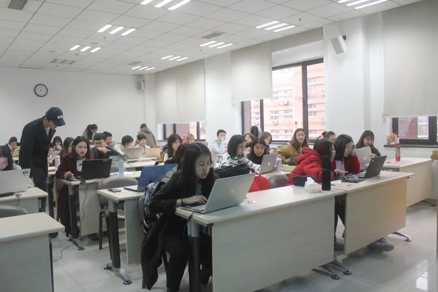
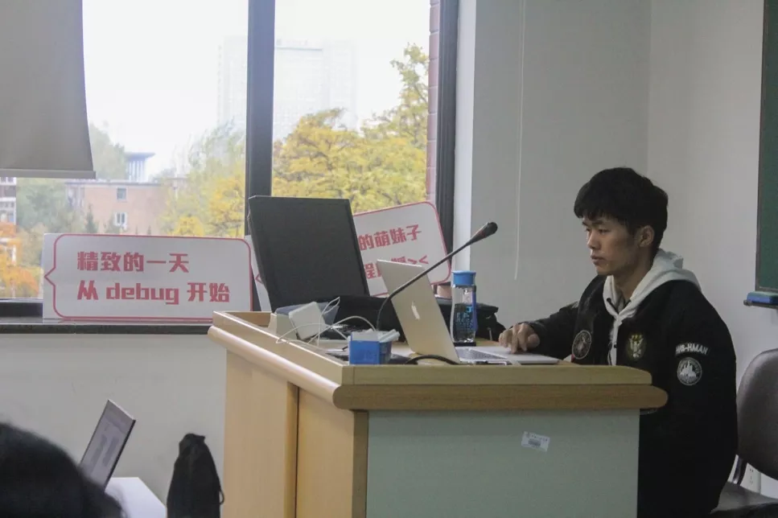
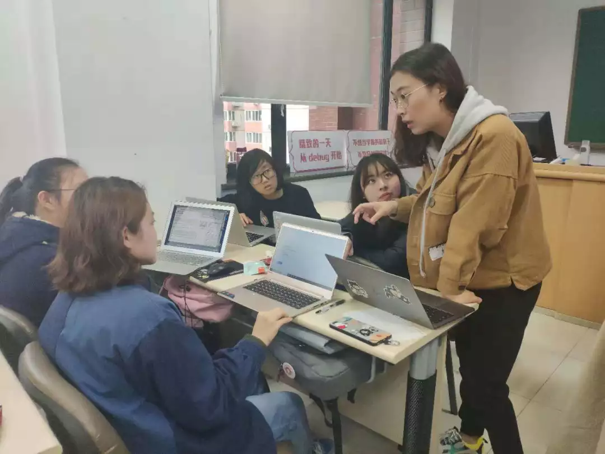
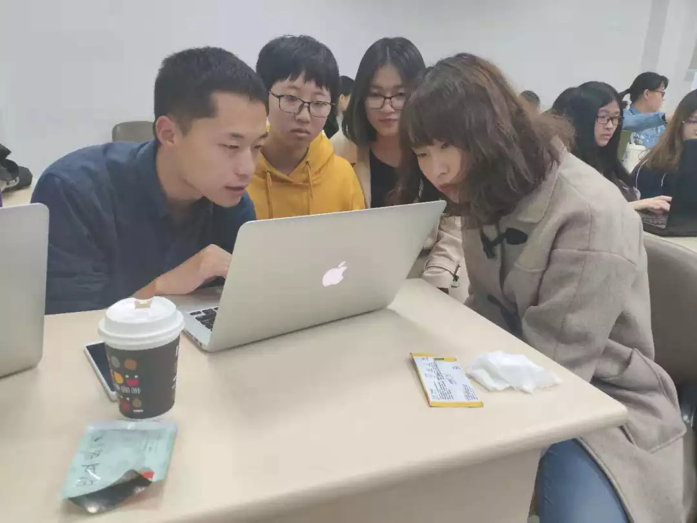
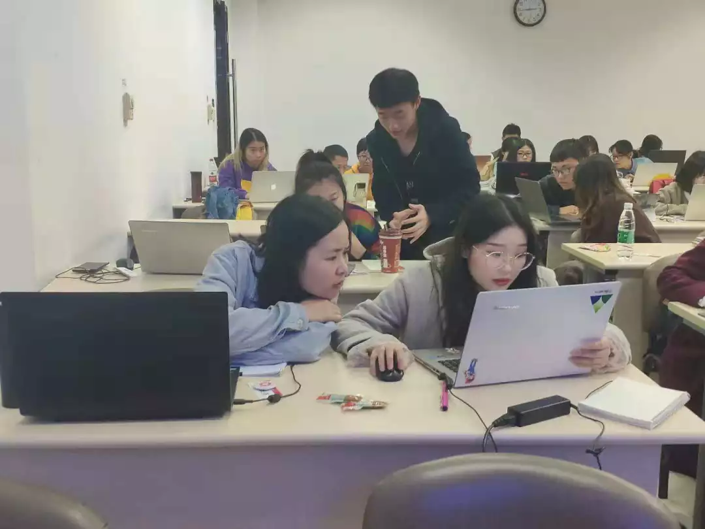
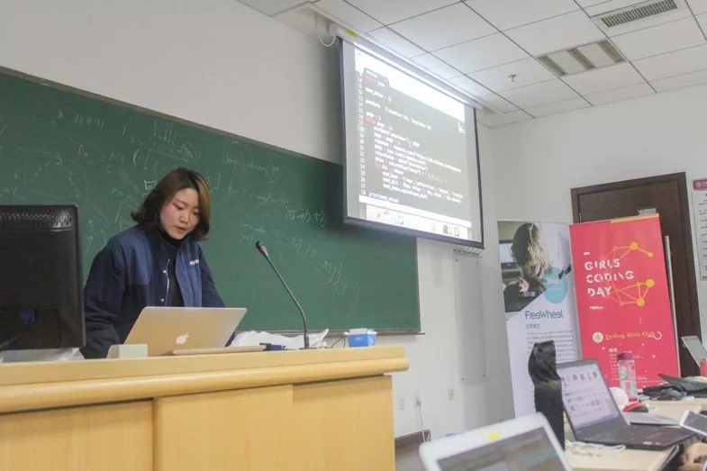
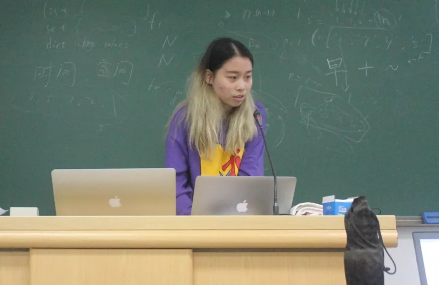
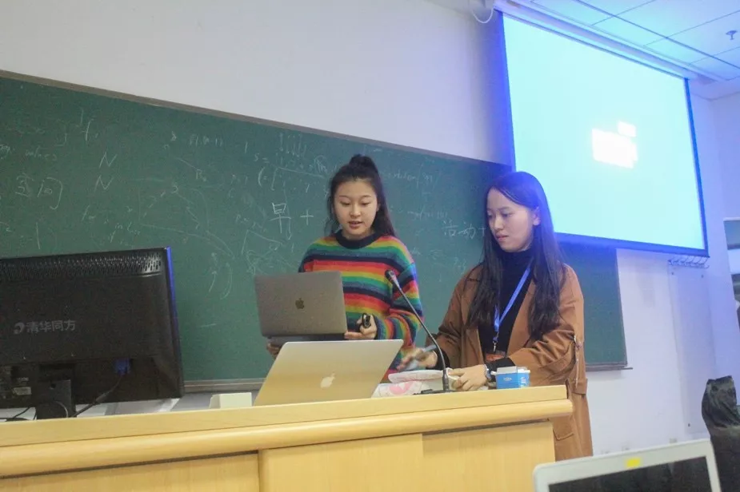
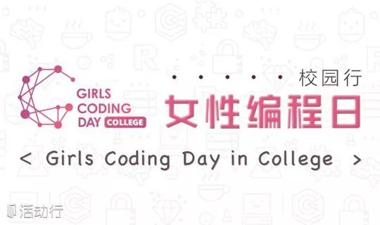

**文字&图片：单诗雅**  
**编辑：杨瑾**  

2018年11月4日，在中国人民大学，Girls Coding Day如约而至。1位讲师，10名教练，40余名学员共同进行了一场美妙的编程之旅。  

  

还没到预先约定的签到时间，就已经有同学提前来到了女性编程日活动开展的地方。志愿者们早已布置好了场地，一切都是有条不紊的样子。
学员们陆陆续续到来，在签到台前领取自己名片和徽章。志愿者们在一旁耐心解答学员们的疑问，引导学员分组就座，这些小细节使大家很快地融入到这个自己的小团队里。

  

上午十点，活动正式开始，讲师首先简要介绍了本次活动，为大家讲述了女性与编程的关系，使大家对活动的意义有了更深的理解。紧接着，就是干货满满的课程内容啦~

  

**本次活动采用讲师做引入和通讲，教练有针对地指导小组成员的方式，让大部分初次接触编程的学员们不仅没有产生畏难情绪，反而对此充满了好奇。**  

学员们在与教练和小伙伴的积极交流中，解决自己的疑惑，不断获得成长。活动中精心准备的小零食，也让大家始终保持能量。  

午饭过后，大家在教室小憩，还有学员在继续思考上午学习到的编程知识。下午一点半，大家鼓足精神开始新一轮的学习。讲师为大家解答了上午的疑惑，并讲授了更深入的知识。经过教练的指导，学员们已经能够独立地编写一些简单的代码了，并在自己操作的过程中，不断从中发现问题，认真思考。通过大家的共同探讨，遇到的问题都得到了很好的解决。  

  

下午四点二十，大家以小组为单位，开始探讨留下的作业。整个过程也更像是一个不断试错的过程，面临着未曾预料的问题，大家迎难而上，教练凭借着自己的丰富经验，随机应变找出解决方法，学员们也纷纷提出自己的设想，大家彼此协作，齐头并进。  

  

  

五点半，小组展示正式开始，由于时间有限，未能展示所有小组的成果。上去代表小组做展示的三个学员都信心满满，她们展示的成果各有亮点，又引发了大家新的思索。  

    

  

下午六点，活动圆满结束，学员们都领到了属于自己的优秀学员证书，拍了大合照，不少同学还自发与本组的教练合影留念，每个人脸上都洋溢着满足感。  

  

虽然本次活动已经告一段落，但这只是学员们编程之旅的第一站，希望大家能够带着信心，在编程的路上走的更远，收获更多。无论何时，只要拥有想要尝试的心，你都能发掘自身更多的可能性~  

  

