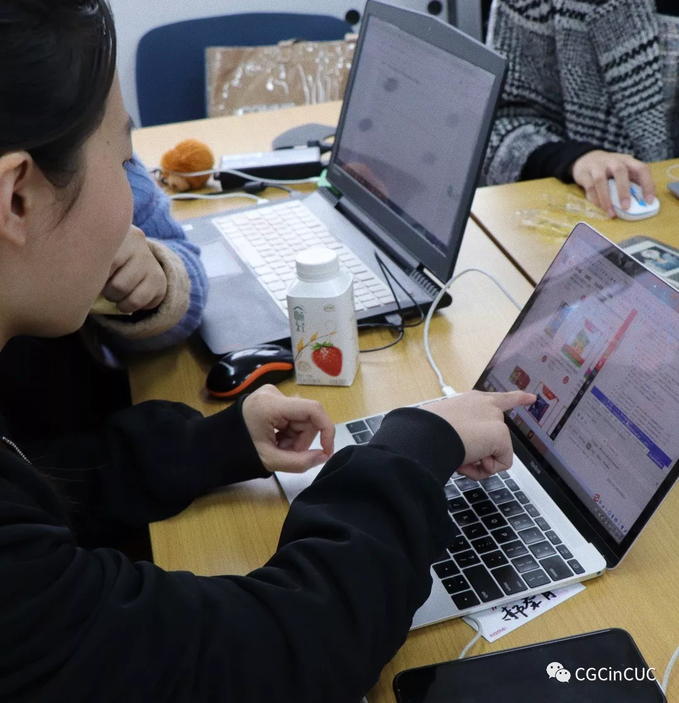
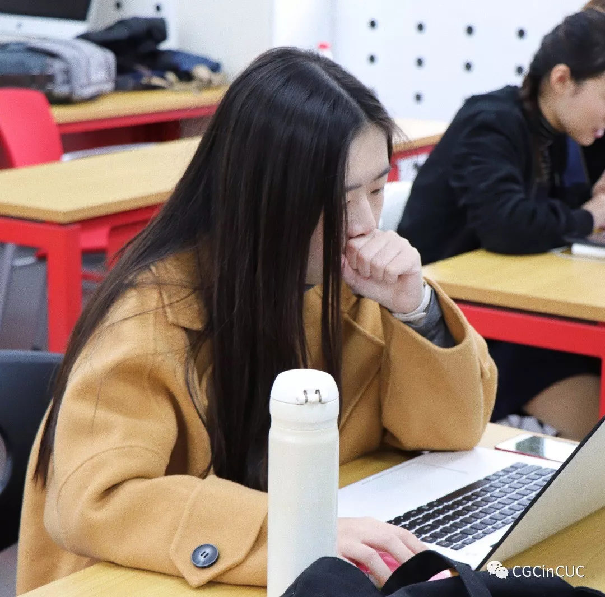

**撰稿：柳依笛**  
**排版：柳依笛**  

经过近一个月的前期宣传和筹备工作，11月4日，Girls Coding Day中传站的活动随着线下workshop的成功举办而圆满完成。  

在这其中，少不了的是项目牵头人和为本次活动作出巨大贡献的志愿者们从始至终的坚持和努力。而对于Girls Coding Day中传站的活动，她们也表示，参与这样的活动，“既丰富又有意义”。  

> 郑婉吟<项目牵头人>：
> “能够来参与这个活动，真的很感谢大家。”

和其他高校的项目牵头人不同的是，郑婉吟真正接手到中传的项目已经是十月初。在她第一次在微博上看到这条面试信息时，高校项目牵头人申请的日期早已截止。  

但她还是抱着试一试的心态向尚未关闭的报名通道投递了申请。用她的话来说，“一直对这个方面比较感兴趣。感觉大家对女性从事这个行业的偏见还比较多，就有意识地去微博上搜索这种活动。一切都很巧，再怎么也要试试。”很幸运的是，不久郑婉吟便收到了Coding Girls Club总部传来的回复简讯。  

“大概是由于另一个报名中传站项目牵头人的师姐在外地实习，而我在校内比较适合做这种项目，所以他们就从两个人的抉择中选择了我。”说起这个，她有些庆幸地笑了笑。  

而事实证明，郑婉吟的确成功地担下了牵头人的重担。  

  

由于正式接到项目通知时，距离11月初的线下活动还有不到一个月的时间，这使项目的策划和准备更为艰难。郑婉吟迅速地找到同班的同学当项目的媒体负责人，而到寻找教练管理人时遇到了瓶颈。处在电视学院的郑婉吟对于理工学部的学生了解甚少，直到通过英语广播台的师哥将消息传播到理工学部的大群里，教练负责人才真正有了着落。  

  

对于郑婉吟来说，这是大二的她第一次挑大梁去举办这样一个中小型规模的活动。Girls Coding Day的具体流程比想象中要复杂不少，而郑婉吟除了要在第一时间理清自己的思路，还要把流程用更简明的方式传达给更多人，这无疑是她最初的陡坡。  

随着活动宣传的逐渐深入，她对活动安排也更得心应手。起初让她担心的学员人数不够的问题并没有出现，但意料之外教练人数不足的情况却让活动棘手起来。  

“我们是传媒类大学，算是偏文的学校，很担心各位对编程不感兴趣，无法招募满学员和教练。教练一直都是很大的问题。我们的学校在朝阳，很多科技公司都在海淀。所以在调剂的过程中，就出现了许多教练不愿意来我们学校的情况。地理位置不好，太远了。”  

为了保证教练的质量，在这样的情况下，郑婉吟仍坚持对报名的教练进行了严格筛选。而到了最终，参加线下活动的教练人数达到5人。  

在线下的workshop活动尾声，郑婉吟站在讲台旁，她有些哽咽。“我觉得首先，大家能够坚持来对我来说就是一种很大的支持，很感谢了。希望大家都能在活动中获得一些知识和乐趣。”  
 
>  “能够来参与这个活动，真的很感谢大家。”她这样说。  

_高一凡／栾新萍<志愿者代表>：_
> “对我们这代人有信心。”  

高一凡和栾新萍是在朋友圈的推送里看到Girls Coding Day活动的志愿者招募信息的。在了解到活动具体内容后，她们递交了志愿者的申请。  

前期的志愿工作琐碎而费时，除了在群里接收活动安排外，她们同时还要抽出学习外的时间负责部分公众号推送的排版。而在线下活动的当天，她们也早早来到现场，进行场地的布置和教练讲师的接头。  

虽然对编程有所兴趣，栾新萍这次还是选择当活动的志愿者。“想先多参加一些这样的志愿活动提高自己的能力。”在被问及前来当志愿者的原因时，她提到了这一点。  

而高一凡则坦言，说实话，自己对编程并没有很大的兴趣，参加志愿者是因为活动上写着的“女性高校编程日”。  

“看到‘女性’编程的时候就想报名了。高中的时候朋友说想要‘把女权主义推向主流社会’，当时听了还很宏大，但是后来慢慢地作为一个女性，看到社会上男女仍然不平等的种种现象，还有各种领域对女性的歧视，就感觉自己要为改变这个现状作出一点点贡献。”她说。  

成功完成了这一阶段的志愿活动后，她们或多或少都有了成长。不论是在成为一名优秀志愿者的方面上也好，还是在成为女权捍卫者的角度上也好，她们都更加有了底气。  

高一凡和栾新萍觉得，女性不该被现有畸形的行业所误导。“做推送的时候，看到说第一个编程的人是女性。女性应该选择相信这个现状能因为自己的加入发生一点小小的改变。误解肯定是会长期存在的，但它一定会慢慢弱化。”  

她们说——“对我们这代人有信心。”

 

