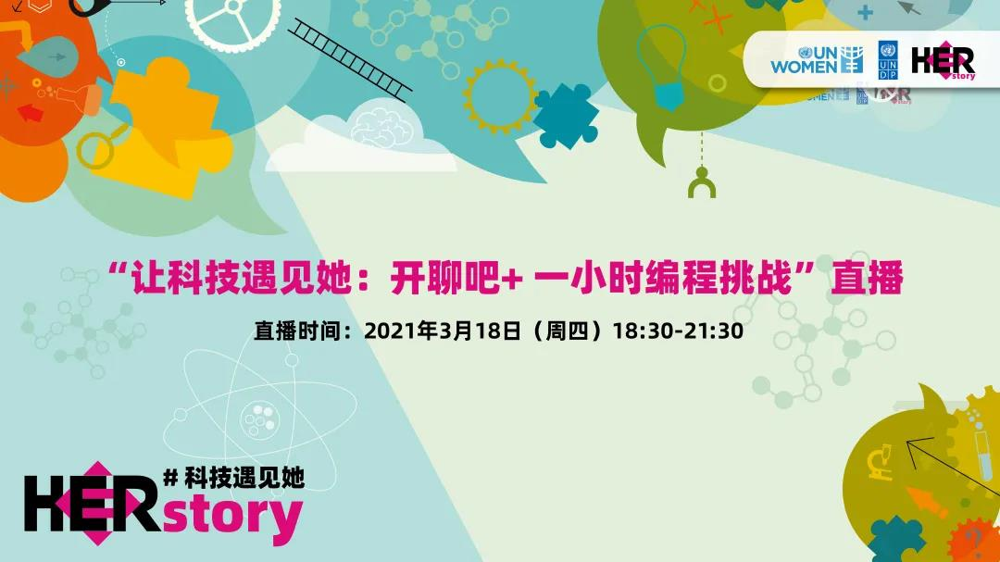
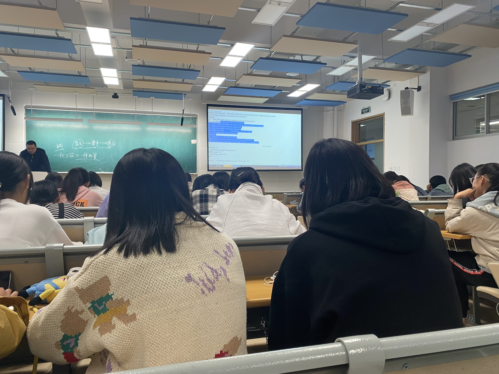
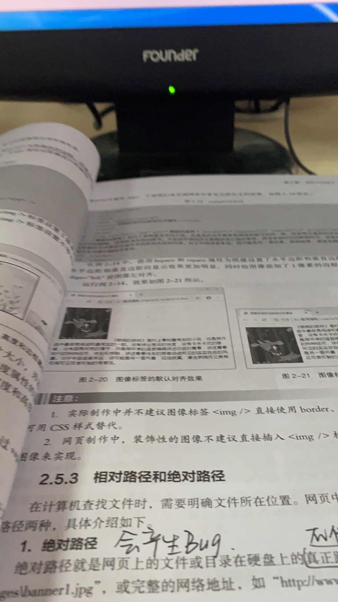
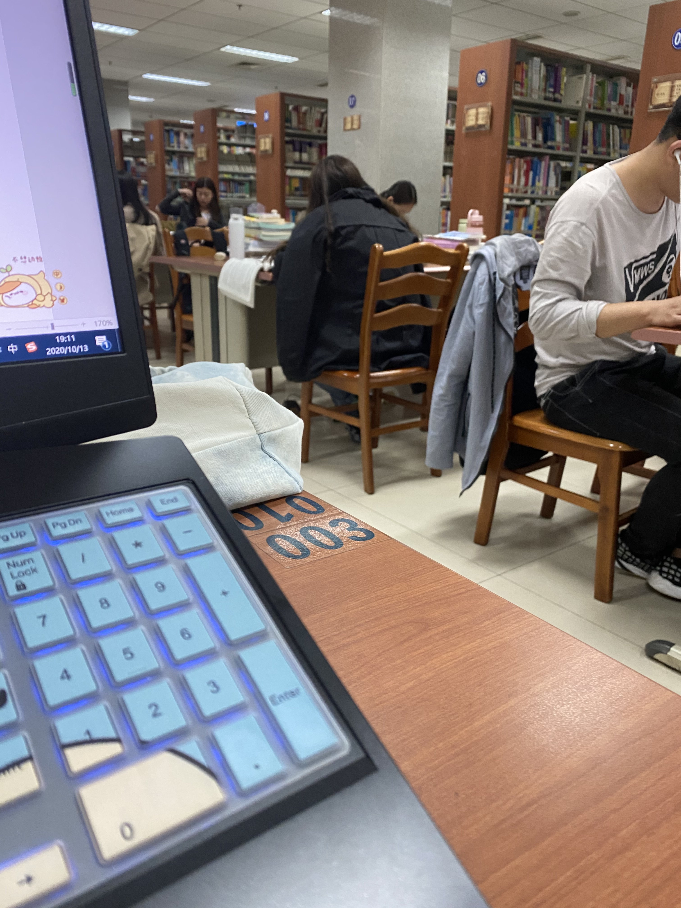
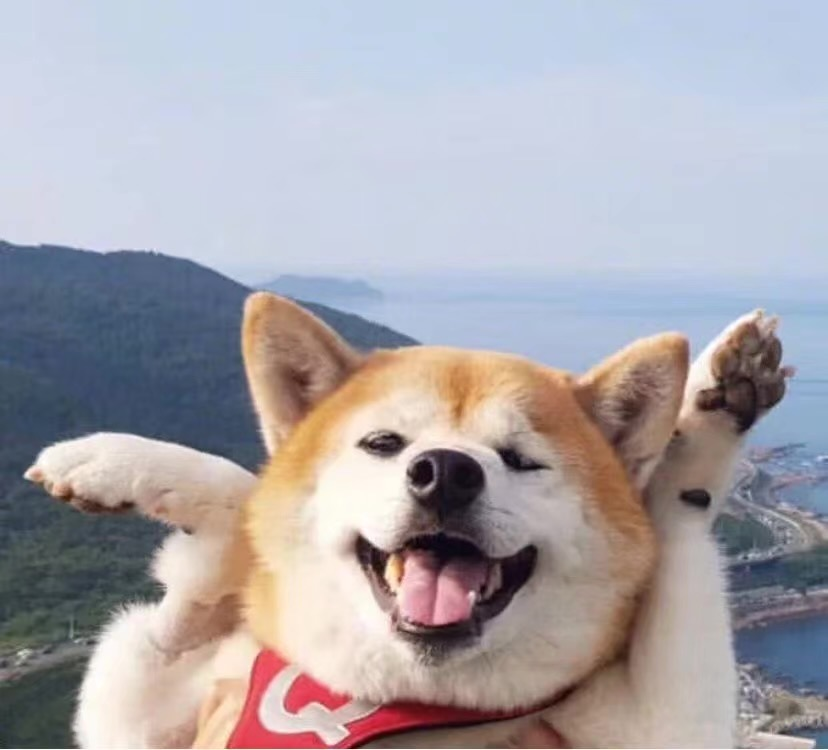

# 我与科技的相遇

## _MYstory_

很高兴可以参加这次联合国开发计划署和联合国妇女署所一起筹办的一小时编程挑战

文：权欣
图：权欣

### ***每一次的相遇都是前世的500次回眸所换来的，而当我遇见“科技”，这之间又会碰撞出怎样的火花？***

​      我目前是一名数据科学与大数据技术的大一学生，与科技的相遇，我认为是一次其妙到不能再奇妙的事，或者说是之前从来没有想过的事。说来很搞笑，在我人生的前18年里，从来没有去当一名程序员的想法，在我的心中，程序员一直是枯燥，无聊，整日面对电脑，眼镜厚度快赶上啤酒瓶儿底的代名词。

**这是上课的时候呀！**

​        而我从来都不想成为其中的一员，但是很不凑巧，我的文科成绩真的是不咋地，而且我本人扪心自问，确实是比较喜欢理科，所以在文理分科的时候，我义无反顾的选择了理科，但是在这个时候我的内心依旧栽种着一颗向往文科的大树，现在想想或许是因为在高中繁重的课业里根本就没有时间去了解什么专业是干什么的，并且爸妈都是学文出身，最大的了解可能也是自己脑补出来的吧！但是在高考过后的漫长暑假里，在我掏出报志愿手册的时候，一个个去了解专业的时候，我仿佛打开了另一个世界的大门。在我仔细了解过后，发现，原来我之前所向往的专业可能是受我身边人影响，内心潜移默化的认为我可能要继续顺着这条看似明朗的道路走下去。在我深入了解了我现在的专业后，我将它作为了我的第一个志愿，我并没有因为自己是一个女生而选择所有人都认为适合的专业，而是选择了自己真正感兴趣的事，因为我始终相信，兴趣是最好的老师。在现在回想起来，我感谢曾经的自己，选择了这一条道路，选择了我从来没有接触过的新兴事物。

**初步学习HTML**

​        在学习的这半个学期里，我认识了不一样的自己，一个对编程充满兴趣的自己，这让我学习起来更有动力。作为一个21世纪的大学生，我并不认为性别就可以匹配适合或者不适合，但是不排除有些行业确实对身体素质要求很高，而男女之间的力量悬殊的确让男生更加适合，但是我认为家长应该做到可以让孩子进行一个自己的选择，而父母可以进行一下自己的建议，而不是去干扰。我能遵从自己的内心，去选择自己喜欢的专业，无疑于要感谢我的父母。

**图书馆里奋力敲代码的girl**

​       我与科技的相遇，肯定会成为未来日子里所一直存在的东西。虽然目前还是一只小菜鸟，但我相信，菜鸟也会终有一天变成一只老鸟的。科技的不断发展，让我们可以了解到更加广阔的世界，听到不同的声音，时光不怠，未来可期，一切充满了机遇的时光就是最好的展现，我可以去做我所热爱的事情，可以发出自己的声音，可以通过自己的微光去影响别人。

### ***人生中某些不起眼的人、事，终有一天会散发出流光溢彩！***

